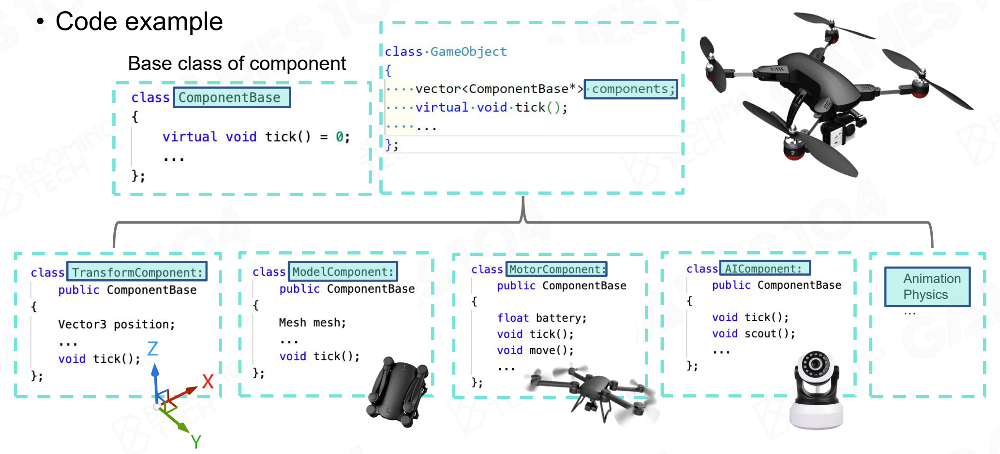

# 2. Basic Elements

## Layered Architecture of Game Engine

- Tool layer (chain of editors)
- Function layer (make it visible, movable & playable: rendering; animation; physics; script, FSM & AI; camera, HUD & input)
- Resource layer (data & files: .psd, .max, .maya, .mp3, .xml, .mpeg...)
- Core layer (Swiss Knife)
- Platform layer (cross-platform support: operating system, platform file system, graphics API, platform SDK, consoles, input devices, publishing platforms...)
- Third-party libraries (middleware):
  - Physics & animation: [Havok](https://www.havok.com/), [PhysX](https://github.com/NVIDIAGameWorks/PhysX)
  - Audio: [Wwise](https://www.audiokinetic.com/products/wwise/), [FMOD](https://www.fmod.com/)
  - Rendering: [trueSKY™](https://simul.co/), [Enlighten](https://www.siliconstudio.co.jp/middleware/enlighten/en/)
  - Others: [SpeedTree](https://store.speedtree.com/) (3D Vegetation Modeling), [Simplygon](https://www.simplygon.com/) (3D optimization)


### Resource Layer

How to access data?

Offline Resource Importing:

- Unify file access by define a meta asset file format (i.e., `.ast`)
- Assets are faster to access by importing preprocess
- Build a composite asset file (e.g., .xml file) to refer to all resources (indicate relationships & references)
- GUID (global unique ID) is an extra protection of reference


Runtime Asset Manager

- A virtual file system to load/unload assets by path reference
- Manage asset lifespan and reference by **handle system**


Asset Management Life Cycle

- Different resources have different life cycles
- Limited memory requires release of loaded resources when possible
- **Garbage collection** & **deferred loading** is critical features


### Function Layer

How to make the world alive? 

Dive into `Tick()`: Logic before Render

```c++
void tickMain(float delta_time)
{
    while (!exit_flag)
    {
        tickLogic(delta_time);
        tickRender(delta_time);
    }
}

void tickLogic(float delta_time)
{
    tickCamera(delta_time);
    tickMotor(delta_time);
    tickController(delta_time);
    tickAnimation(delta_time);
    tickPhysics(delta_time);
    /*...*/
}

void tickRender(float delta_time)
{
    tickRenderCamera();
    culling();
    rendering();
    postprocess();
    present();
}
```


In each tick (over-simplified version):

- fetch animation frame of character
- drive the skeleton and skin of character
- renderer process all rendering jobs in an iteration of render tick for each frame


Function layer is a heavy-duty hotchpotch

- Function layer provides major function modules for the game engine 
  - object system (HUGE)
- Game Loop updates the systems periodically
  - Game Loop is the key of reading codes of game engines
- Blur the boundary between engine and game
  - Camera, character and behavior
  - Design extendable engine API for programmer


Multi-Threading: Many systems in game engine are built for parallelism as multi-core processors become the mainstream.


### Core Layer

**Math Library**

Need to implement our own Math Library that ensures efficiency.

- linear algebra (transformations, matrix splines, quaternion)
- vector calculus (physics simulation)


**Math Efficiency**

- e.g., the "fast inverse square root" algorithm (quickly computing the inverse square root of a floating-point number, $1/\sqrt{x}$). It was famously used in the game *Quake III Arena* to speed up computations that involved normalizing vectors.

  ```c++
  float Q_rsqrt(float number)
  {
      long i;
      float x2, y;
      const float threehalfs = 1.5F;
  
      x2 = number * 0.5F;
      y = number;
      i = *(long*)&y;             // Evil bit-level hacking
      i = 0x5f3759df - (i >> 1);  // What the heck?
      y = *(float*)&i;
      y = y * (threehalfs - (x2 * y * y)); // 1st iteration
      // y = y * (threehalfs - (x2 * y * y)); // 2nd iteration, this line is optional
  
      #ifndef Q3_VM
      #ifdef __linux__
      assert(!isnan(y));
      #endif
      #endif
  
      return y;
  }
  
  ```

  **Variables:**

  - `i`: An integer used for bitwise manipulation.
  - `x2`: Half of the input number (`number * 0.5`).
  - `y`: The initial guess for the inverse square root.
  - `threehalfs`: Constant value of `1.5`, used in the Newton-Raphson iteration.

  **Steps:**

  - **Bit Manipulation:**
    - `i = *(long*)&y;` reinterprets the floating-point number `y` as a long integer. This is done to manipulate the bits of the float directly.
    - `i = 0x5f3759df - (i >> 1);` is the core of the "magic" in the algorithm. The constant `0x5f3759df` is a precomputed value that works well for this specific bit manipulation, and the operation `i >> 1` effectively halves the exponent part of the floating-point number. Subtracting this from the constant gives an initial guess for the inverse square root.
  - **Type Casting Back:**
    - `y = *(float*)&i;` converts the manipulated bits back to a floating-point number, resulting in the initial approximation for the inverse square root.
  - **Newton-Raphson Iteration:**
    - `y = y * (threehalfs - (x2 * y * y));` is a Newton-Raphson iteration to refine the approximation. It corrects the initial guess to make it more accurate.
  - **Assertions (Optional):**
    - The lines inside the `#ifndef` and `#ifdef` directives are used to check for NaN (Not a Number) results, which would indicate a failure in the computation. These lines are typically used in debugging on Linux systems.
  - **Return:**
    - Finally, the function returns the computed inverse square root of the input number.

- SIMD

  

  

**Data Structure & Containers**

Need to implement our own data structures & containers (C++ STL will cause memory fragmentation): array, vector, linked list, stack, queue, tree, heap, graph, hashing, skeleton tree, animation frame sequence...

 


**Memory Management**

- Major bottleneck of game engine performance
  - memory poll/allocator
  - reduce cache miss
  - memory alignment
- Polymorphic Memory Resource (PMR)


Core Layer is the foundation of Game Engine

- provides utilities needed in various function modules
- is designed & implemented for super high performance
- has a high standard of coding


### Platform Layer

Ensures compatibility of different platforms, provides platform-independent services & information for upper layers


File System

- Path: Slash/backslash, environment variables
- Directory traversal


Graphics API

Render Hardware Interface (RHI)

- Transparent different GPU architectures and SDK
- Automatic optimization of target platforms


```c++
// shader
virtual RHIVertexShader* createVertexShader(const DynamicArray<UByte>& shader_bin_code) = 0;
virtual RHIHullShader* createHullShader(const DynamicArray<UByte>& shader_bin_code) = 0;
virtual RHIDomainShader* createDomainShader(const DynamicArray<UByte>& shader_bin_code) = 0;
virtual RHIGeometryShader* createGeometryShader(const DynamicArray<UByte>& shader_bin_code) = 0;
virtual RHIPixelShader* createPixelShader(const DynamicArray<UByte>& shader_bin_code) = 0;
virtual RHIComputeShader* createComputeShader(const DynamicArray<UByte>& shader_bin_code) = 0;

// buffer
virtual RHIVertexBuffer* createVertexBuffer(RHIResourceCreateInfo& create_info) = 0;
virtual void* lockVertexBuffer(RHIVertexBuffer* vertex_buffer, UInt offset, UInt size, EResourceLockMode lock_mode) = 0;
virtual void unlockVertexBuffer(RHIVertexBuffer* vertex_buffer) = 0;

virtual RHIIndexBuffer* createIndexBuffer(RHIResourceCreateInfo& create_info) = 0;
virtual void* lockIndexBuffer(RHIIndexBuffer* index_buffer, UInt offset, UInt size, EResourceLockMode lock_mode) = 0;
virtual void unlockIndexBuffer(RHIIndexBuffer* index_buffer) = 0;

```


Hardware Architecture

- Core variants: PPU and SPUs
- UMA: unified memory access


### Tool Layer

Level editor, logical editor, animation editor, UI editor, shader editor...


Allow anyone to create games

- unleash creativity: create, edit, exchange gameplay assets
- coding language flexibility: C++, C#, JavaScript


Digital Content Creation

Asset Conditioning Pipeline (import & export)

It is important to use a file format that can keep data standardized across software programs, which can help with transferring 3D assets (e.g., .fbx, .usd).


### Why Layered Architecture?

- Decoupling & reducing complexity
  - Lower layers are usually independent from upper layers
  - Upper layers don't know (and usually don't need to know) how lower layers are implemented
- Response for evolving demands
  - Upper layers evolve fast, but lower layers are typically stable


## How to Build a Game World

### Game Object

What makes up a game world? Game objects!

- dynamic game objects
- static game objects
- environments: sky, vegetation, terrain...

- other game objects: air wall, trigger area, navigation mesh, game rule...

> Everything is a Game Object!


### Component

How to describe a GO? Components!


Traditional property-behavior-based class inheritance may not be suitable for modern complex game designs: there could be too many combinations of different classes that have different properties & behaviors. So there's no perfect (clear) classification in the game world.


Instead, we can use component-based method (modules) to describe a game object.



E.g., a drone and armed drone may share the same components of transform, model, animation, motor, physics, etc. But they have different AI & combat (and many other) components.


Components in commercial engines:


### Tick

How to make the world alive? Tick!


Object-based Tick

- Simple & intuitive
- Easy to debug


Component-based Tick (Pipeline)

- Parallelized processing
- Reduced cache miss


### Event

How to make GOs communicate with each other? Event system!

- Event sending & handling
- Decoupling event sending & handling


Event Mechanism in commercial engines:


### Scene Management

How to manage GOs?

- GOs are managed in a scene
- GOs are queried by
  - unique game object ID
  - object position


Simple space management

- grid division (fails when GOs are unevenly distributed)
- hierarchical segmentation (use spatial data structures like quadtree)


### Course Takeaways

- Everything is an object
- Game object could be described in a component-based way
- States of game objects are updated in tick loops
- Game objects interact with each other via event mechanism
- Game objects are managed in a scene with efficient strategies


Some real-world concerns:


