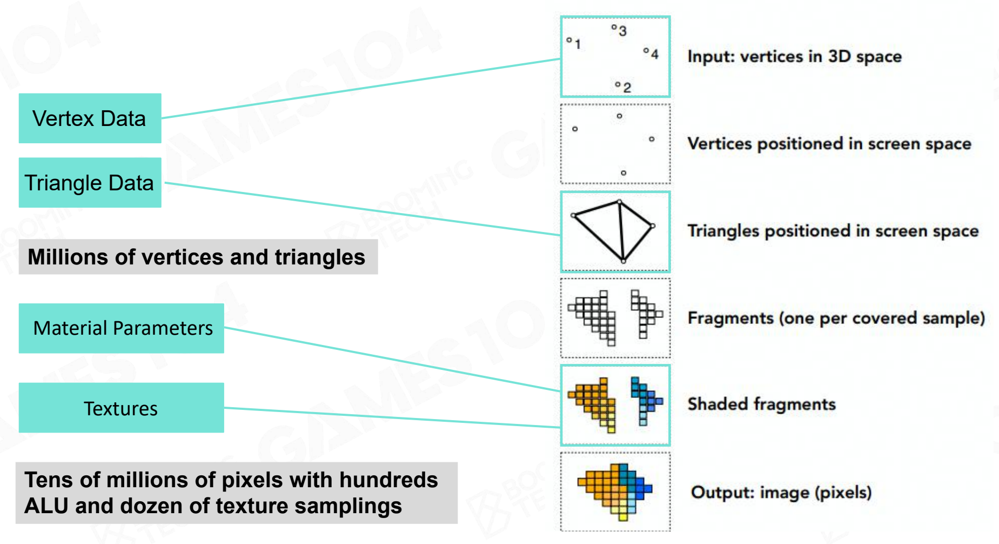
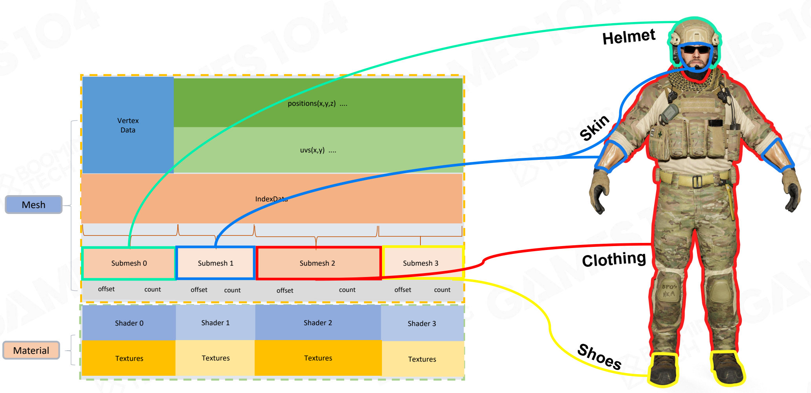

# 3. Rendering

## Basics of Game Rendering

Rendering in Graphics Theory:

- Usually has a well-defined problem to solve: rendering objects with one type of effect
- Focus on representation & math correctness, instead of how the hardware implement the algorithm
- No strict performance requirement:
  - Realtime rendering (30 FPS)
  - Interactive rendering (10 FPS)
  - Offline rendering (take hours/days to render a frame)
  - Out-of-core rendering (data too large to be saved in just one machine, have to use distributed storage across several machines)

Challenges of Game Rendering

- Huge amount of object numbers, types, and wanted effects (skin, fur, fluid, foliage...). Everything is in one container; extremely complex.
- Have to understand the hardware architecture, have to deal with the architecture of modern computer with a complex combination of CPU & GPU
- Require the framerate to be stable on various devices
  - 30 FPS (60 FPS, 120 FPS+VR)
  - 2K, 4K, 8K resolution
- Limit access to CPU bandwidth & memory (only 10~20% for rendering; game logic, network, animation, physics & AI systems are major consumers of CPU and main memory)

> The rendering system in game engine is a heavily optimized practical software framework to fulfill the critical rendering requirements of games on modern hardware (PC, console and mobiles)

### Building Blocks of Rendering

Rendering Pipeline and Data

Computation - Projection and Rasterization

Computation - Shading

A shader sample code

- Constants / Parameters
- ALU algorithms
- Texture Sampling (complex & expensive)
- Branches

Computation - Texture Sampling

Filter & Mipmapping: For one texture sampling, if use trilinear filtering, will need 8 samples and 7 interpolations

The above-mentioned massive computations can resort to GPUs (dedicated hardware to solve massive jobs).

### Hardware Architecture

SIMD & SIMT

- SIMD (Single Instruction Multiple Data)

  Describes computers with multiple processing elements that perform the same operation on multiple data points simultaneously (e.g., matrix operations)

- SIMT (Single Instruction Multiple Threads)

  An execution model used in parallel computing where single instruction, multiple data (SIMD) is combined with multithreading

GPU Architecture

See more details in [Nvidia GPU Architecture](<./Extra/Nvidia GPU Architecture.md>).

Data Flow from CPU to GPU

- CPU and Main Memory
  - Data Load / Unload
  - Data Preparation
- CPU to GPU
  - High Latency
  - Limited Bandwidth
- GPU and Video Memory
  - High Performance 
  - Parallel Rendering

Move data from CPU to GPU back and forth will cause obvious latency (between logic & rendering).

> Best practice: Always minimize data transfer between CPU & GPU when possible.

Be Aware of Cache Efficiency

- Take full advantage of hardware parallel computing
- Try to avoid [von Neumann bottleneck](https://cs.stackexchange.com/questions/105712/what-is-von-neumann-bottleneck)

> "Anything the computer tries to do is bottlenecked by the connection between the processor and memory."
>
> "Getting data from memory is slower than processing it."

GPU Bounds and Performance
Application performance is limited by:

- Memory Bounds
- ALU (Arithmetic Logic Unit) Bounds 
- TMU (Texture Mapping Unit) Bound
- BW (Bandwidth) Bound

Modern Hardware Pipeline

Other State-of-Art Architectures

### Renderable

- mesh primitive (vertex buffer (position, texture, normal...), index buffer, triangle)

> Note: Remember to define a normal for each vertex!

- material
  - Phong Model
  - PBR Model
  - Subsurface Model

- texture
  - albedo
  - normal
  - metallic
  - roughness
  - ambient occlusion (ao)
  - ...
- shader (how to draw the above data)

How to Display Different Textures on a Single Model? Use submesh! Different submeshes will have their own material (texture & shader)

However, creating such data for each game object will be too consuming. To avoid memory waste, we can build a  **Resource Pool**. Each pool stores the data that could be used and shared among game objects.

Optimization 1: Render objects that share the same material together.

Optimization 2: Use GPU batch and render objects that share the same material & submesh together.

### Visibility Culling

Culling of one object: Check if its bounding box is inside the view frustum

## Lighting, Materials and Shaders

### PBR (SG, MR)

### Shader Permutation

### Lighting

Point / Directional lighting

IBL / Simple GI

## Special Rendering

### Terrain

### Sky/Fog

### Postprocessing

## Rendering Pipeline

Forward, deferred rendering, forward plus
Real pipeline with mixed effects 
Ring buffer and V-Sync
Tiled-based rendering