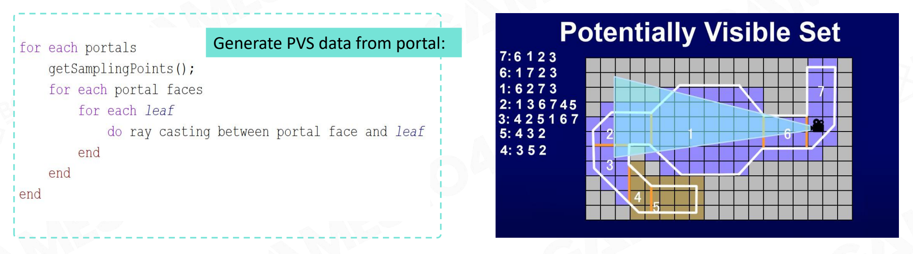
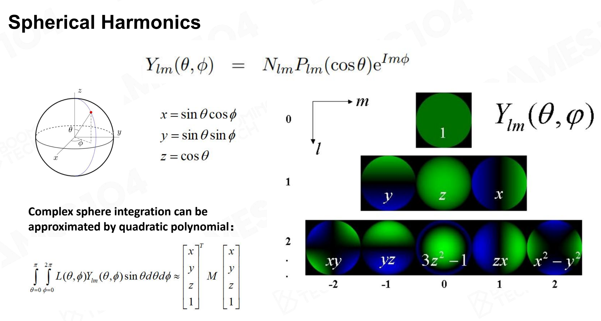

# 3. Rendering

## Basics of Game Rendering

Rendering in Graphics Theory:

- Usually has a well-defined problem to solve: rendering objects with one type of effect
- Focus on representation & math correctness, instead of how the hardware implement the algorithm
- No strict performance requirement:
  - Realtime rendering (30 FPS)
  - Interactive rendering (10 FPS)
  - Offline rendering (take hours/days to render a frame)
  - Out-of-core rendering (data too large to be saved in just one machine, have to use distributed storage across several machines)


Challenges of Game Rendering

- Huge amount of object numbers, types, and wanted effects (skin, fur, fluid, foliage...). Everything is in one container; extremely complex.
- Have to understand the hardware architecture, have to deal with the architecture of modern computer with a complex combination of CPU & GPU
- Require the framerate to be stable on various devices
  - 30 FPS (60 FPS, 120 FPS+VR)
  - 2K, 4K, 8K resolution
- Limit access to CPU bandwidth & memory (only 10~20% for rendering; game logic, network, animation, physics & AI systems are major consumers of CPU and main memory)

> The rendering system in game engine is a heavily optimized practical software framework to fulfill the critical rendering requirements of games on modern hardware (PC, console and mobiles)


### Building Blocks of Rendering

Rendering Pipeline and Data


Computation - Projection and Rasterization


Computation - Shading

A shader sample code

- Constants / Parameters
- ALU algorithms
- Texture Sampling (complex & expensive)
- Branches


Computation - Texture Sampling

Filter & Mipmapping: For one texture sampling, if use trilinear filtering, will need 8 samples and 7 interpolations


The above-mentioned massive computations can resort to GPUs (dedicated hardware to solve massive jobs).


### Hardware Architecture

SIMD & SIMT

- SIMD (Single Instruction Multiple Data)

  Describes computers with multiple processing elements that perform the same operation on multiple data points simultaneously (e.g., matrix operations)

- SIMT (Single Instruction Multiple Threads)

  An execution model used in parallel computing where single instruction, multiple data (SIMD) is combined with multithreading


GPU Architecture

See more details in [Nvidia GPU Architecture](<./Extra/Nvidia GPU Architecture.md>).


Data Flow from CPU to GPU

- CPU and Main Memory
  - Data Load / Unload
  - Data Preparation
- CPU to GPU
  - High Latency
  - Limited Bandwidth
- GPU and Video Memory
  - High Performance 
  - Parallel Rendering

Move data from CPU to GPU back and forth will cause obvious latency (between logic & rendering).

> Best practice: Always minimize data transfer between CPU & GPU when possible.


Be Aware of Cache Efficiency

- Take full advantage of hardware parallel computing
- Try to avoid [von Neumann bottleneck](https://cs.stackexchange.com/questions/105712/what-is-von-neumann-bottleneck)

> "Anything the computer tries to do is bottlenecked by the connection between the processor and memory."
>
> "Getting data from memory is slower than processing it."


GPU Bounds and Performance
Application performance is limited by:

- Memory Bounds
- ALU (Arithmetic Logic Unit) Bounds 
- TMU (Texture Mapping Unit) Bound
- BW (Bandwidth) Bound


Modern Hardware Pipeline


Other State-of-Art Architectures


### Renderable

- mesh primitive (vertex buffer (position, texture, normal...), index buffer, triangle)

> Note: Remember to define a normal for each vertex!


- material
  - Phong Model
  - PBR Model
  - Subsurface Model


- texture
  - albedo
  - normal
  - metallic
  - roughness
  - ambient occlusion (ao)
  - ...
- shader (how to draw the above data)


How to Display Different Textures on a Single Model? Use submesh! Different submeshes will have their own material (texture & shader)


However, creating such data for each game object will be too consuming. To avoid memory waste, we can build a  **Resource Pool**. Each pool stores the data that could be used and shared among game objects.


Optimization 1: Render objects that share the same material together.


Optimization 2: Use GPU batch and render objects that share the same material & submesh together.


### Visibility Culling

Culling of one object: Check if its bounding box is inside the view frustum


Using the Simplest Bound to Create Culling

- Inexpensive intersection tests
- Tight fitting
- Inexpensive to compute
- Easy to rotate and transform
- Use little memory


Hierarchical View Frustum Culling


BVH: Useful when there're a large number of dynamic objects (insert new nodes fast)


PVS (Potential Visibility Set)


Portal and PVS Data: Determine potentially visible leaf nodes immediately from portal




> Though PVS has gradually faded out in visibility problems, its idea is still useful in game development.


GPU Culling

Occlusion query, Early-Z/Pre-Z:


### Texture Compression

Traditional image compression like JPG and PNG

- Good compression rates

- Image quality
- Designed to compress or decompress an entire image

E.g. Block Compression

Common block-based compression format (use interpolation of source color blocks, lossy compression)

- On PC,  BC7 (modern) or DXTC (old) formats
- On mobile, ASTC (modern) or ETC / PVRTC (old) formats


Game texture compression

- Decoding speed

- Random access (traditional block-based compression algorithms do not support random access)
- Compression rate and visual quality
- Encoding speed


### Authoring Tools of Modeling

Modeling

- Polymodeling: 3ds Max, Maya, Blender...
- Sculpting: ZBrush...
- Scanning
- Procedural Modeling: Houdini, Unreal Engine...


### Cluster-Based Mesh Pipeline

> The trend of rendering pipeline in modern game engine.

Challenge: Sculpting Tools Create Infinite Details

- Artists create models with infinite details 
- From linear fps to open world fps, complex scenes submit 10 times more triangles to GPU per-frame

Solution: Cluster-Based Mesh Pipeline

1. GPU-Driven Rendering Pipeline (2015)

   Mesh Cluster Rendering

   - Arbitrary number of meshes in single drawcall
   - GPU-culled by cluster bounds

   - Cluster depth sorting

2. Geometry Rendering Pipeline Architecture (2021)
  Rendering primitives are divided as:

  - Cluster: 64 triangles strip

  - Surf: submeshes based on materials, composed of many Clusters
  - Batch: a single API draw (``drawIndirect` / `drawIndexIndirect`), composed of many Surfs


Nanite

- Hierarchical LOD clusters with seamless boundary
- Don’t need hardware support, but using a hierarchical cluster culling on the precomputed BVH tree by persistent threads (CS) on GPU instead of task shader


### Course Takeaway

1. The design of game engine is deeply related to the hardware architecture design
2. A submesh design is used to support a model with multiple materials
3. Use culling algorithms to draw as few objects as possible
4. As GPU become more powerful, more and more work are moved into GPU, which is called GPU Driven


## Lighting, Materials and Shaders

Participants of Rendering Computation:

- Lighting: Photon emit, bounce, absorb and perception is the origin of everything in rendering
- Material: How matter react to photon

- Shader: How to train and organize those micro-slaves to finish such a vast and dirty computation job between photon and materials


The (Almighty?) Rendering Equation

- radiance: outgoing light energy from a particular area in a specific direction (W/m²/sr)
- irradiance: incoming light energy to a surface from all directions (W/m²)


Not-So-Almighty:

1. The 1st Challenge: How to get incoming radiance for any given incoming direction
   - Visibility to lights (hard & soft shadows)
   - Light source complexity (directional light, point light, spot light, area light...)
2. The 2nd Challenge: Integral of lighting and scatting function on hemisphere is expensive
3. The 3rd Challenge: To evaluate incoming radiance, we have to compute yet another integral, i.e. rendering equation is recursive (anything could be a light source)


### Starting from Simple

Simple light solution

- Use simple light source as main light (diffuse + specular)
  - Directional light in most cases
  - Point and spot light in special case
- Use ambient light to hack others
  - A constant to represent the average of complex hemisphere irradiance

- Use environment map reflection

  - Use environment map to enhance glossy surface reflection

  - Use environment mipmap to represent roughness of surface


Simple material solution

- Blin-Phong Material (light is addable)

  - ambient

  - diffuse (Lambert's cosine law)

  - specular (half vector)


- Problems of Blin-Phong:

  - Not energy-conservative (outgoing > incoming), unstable in ray-tracing
  - Unable to model complex realistic material (Blin-Phong always looks plastic)

  

  

Simple shadow solution

Shadow is nothing but space where the light is blocked by an opaque object

- Already obsolete method
  - planar shadow
  - shadow volume
  - projective texture

- Extensively used in game industry: Shadow Map


- Problems of Shadow Map:

  Jaggy shadow, moiré pattern, caused by self-occlusion (especially when objects have high-level of details), limited shadow map resolution (sample rate of the shadow map texture from the perspective of the light is usually lower than from the camera), and limited depth precision.

  


### First Glimpse of AAA Quality

#### Precomputed Global Illumination (SH Lightmap)

> Flat ambient light --> indirect illumination

Requirements for indirect light representation:

- good compression rate (need to store millions of radiance probes in a level)
- easy to integral with material function (use polynomial calculation to convolute with material BRDF)


Solution: Fourier Transform, Convolution Theorem, Spherical Harmonics

The Fourier transform is a mathematical function that can be used to find the base frequencies that a wave is made of (can transfer an image from its spatial domain to frequency domain)





Ambient lights (indirect lights) and [soft shadows](https://shengcn.github.io/blog/2020/12/04/spherical_harmonics.html#:~:text=From%20a%20high%20level%20view,integrals%2C%20e.g.%20the%20rendering%20equations.) are usually low-frequency signals, so we won't be bothered with SH with high degrees (higher degree relate to higher frequency, see [Table of spherical harmonics](https://en.wikipedia.org/wiki/Table_of_spherical_harmonics) for details).


SH also has other advantages:

> Convolution of two functions defined on the sphere = Convolution of the projections of these functions onto the Spherical Harmonics (SH) basis


SH Lightmap: Precomputed GI

- Parameterized all scene into huge 2D lightmap atlas (need to simplify the geometry)

  

- Use offline lighting farm to calculate irradiance probes for all surface points

- Compress those irradiance probes into SH coefficients

- Store SH coefficients into 2D atlas lightmap textures

  

  

  

Pros & Cons of Lightmap:

- Pros
  - Very efficient on runtime
  - Bake a lot of fine details of GI on environment
- Cons
  - Long and expensive precomputation (lightmap farm)
  - Can only handle static scene and static light
  - Storage cost on package and GPU

Lightmap is probably obsolete in modern game engines. (E.g., light probes)


#### Light Probe & Reflection Probe

Put light probes at sample points in the scene to simulate GI. Instead of manually set those probes, write an automatic light probe generator for that.


Usually, light probes are diffuse probes that have a high sample rate but low precision (low-frequency, use compression algorithms like SH). Reflection probes on the other hand, are used for specular and high-frequency data, usually have a low sample rate and higher precision.


Pros & Cons of Light Probes + Reflection Probes:

- Pros
  - Very efficient on runtime (use deferred update)
  - Can be applied to both static and dynamic objects
  - Handle both diffuse and specular shading
- Cons
  - A bunch of SH light probes need some precomputation
  - Can not handle fine detail of GI. I.e, soft shadow on overlapped structures


#### Physical-Based Rendering Material

Microfacet Theory


BRDF (Bidirectional Reflectance Distribution Function) Based on Microfacet

- diffuse: Lambertian term
- specular: Cook Torrance
  - D: Normal <font color="#ed7d31">**D**</font>istribution Function (use GGX distribution to describe the microfacets' normals)
  - F: <font color="#92d050">**F**</font>resnel Equation (Fresnel effect: objects become more reflective at grazing angles; steep angle = weak reflection, shallow angle = strong reflection)
  - G: <font color="#4472c4">**G**</font>eometric Attenuation Term (geometry obstruction & self-shadowing due to microfacets), based on the isotropic property of normal distribution, calculated by the multiplication of the discount factors of visual ray & light ray  ($G_{GGX}$ is the remaining percent of ray)


Physical Measured Material


Disney Principled BRDF

Principles to follow when implementing model:

- Intuitive rather than physical parameters should be used
- There should be as few parameters as possible
- Parameters should be zero to one over their plausible range
- Parameters should be allowed to be pushed beyond their plausible range where it makes sense
- All combinations of parameters should be as robust and plausible as possible

Disney Principle Material Parameters:


PBR SG (Specular Glossiness)


```c++
```


### Shader Permutation


### Lighting

Point / Directional lighting


IBL / Simple GI


## Special Rendering

### Terrain


### Sky/Fog


### Postprocessing


## Rendering Pipeline

Forward, deferred rendering, forward plus
Real pipeline with mixed effects 
Ring buffer and V-Sync
Tiled-based rendering